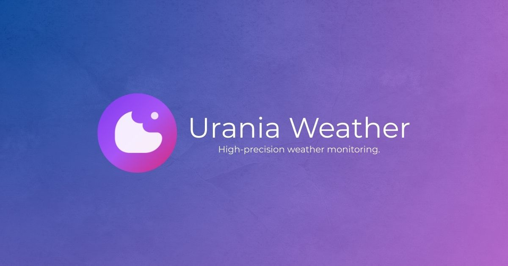

<p align="center">
  <a href="https://nextjs.org/"></a>
  <a href="https://www.typescriptlang.org/"></a>
  <a href="https://vercel.com/"></a>
  <a href="./LICENSE"></a>
</p>

# 🌌 Urania Weather



> **Urania** é um dashboard meteorológico de alta precisão com estética "Deep Cosmos". Construído para ser rápido, visualmente imersivo e rico em dados, utilizando o poder do Next.js 16 e da API OpenWeatherMap.

## ✨ Funcionalidades

O Urania vai muito além de mostrar a temperatura. Ele é um centro de comando meteorológico completo:

- **🌍 Dashboard Imersivo:** Design "Bento Grid" responsivo com tema *Deep Cosmos* (Dark Mode nativo).  
- **📍 Geolocalização & Busca Inteligente:** Detecção automática via navegador ou busca de cidades com filtro visual de país/estado.  
- **📊 Visualização de Dados:**  
  - Gráficos de temperatura para 24h (Recharts).  
  - Previsão detalhada para os próximos 5 dias.  
  - Monitoramento de **Qualidade do Ar (AQI)** e poluentes (PM2.5, SO2, NO2).  
  - Dados Astronômicos (Nascer/Pôr do Sol) e Fuso Horário local.  
  - Direção do vento e detalhes atmosféricos (Pressão, Visibilidade).  
- **🗺️ Mapa Interativo:** Camadas de precipitação, nuvens e temperatura em tempo real via **Leaflet**.  
- **🌐 Internacionalização (i18n):** Suporte completo para Português (BR) e Inglês (EN).  
- **📱 PWA Ready:** Instalável em dispositivos móveis como aplicativo nativo.  
- **⭐ Favoritos:** Sistema de persistência local para salvar suas cidades preferidas.  

## 🛠️ Stack Tecnológico

A arquitetura foi pensada para performance e escalabilidade:

- **Core:** Next.js 16 (App Router) + React 19  
- **Linguagem:** TypeScript  
- **Estilização:** Tailwind CSS + Shadcn/ui (Radix Primitives)  
- **Gerenciamento de Estado:** Zustand (Global) + TanStack Query (Server State & Caching)  
- **Mapas:** React Leaflet  
- **Gráficos:** Recharts  
- **Data & Hora:** Date-fns  
- **Ícones:** Lucide React + FlagCDN  

## 🚀 Como Rodar Localmente

1. **Clone o repositório:**

   ```bash
   git clone https://github.com/seu-usuario/urania.git
   cd urania
   ```

2. **Instale as dependências:**

   ```bash
   npm install
   ```

3. **Configure as Variáveis de Ambiente:**  
   Crie um arquivo `.env.local` na raiz e adicione sua chave da OpenWeatherMap:  

   ```env
   NEXT_PUBLIC_OPENWEATHER_KEY=sua_chave_aqui
   NEXT_PUBLIC_APP_URL=http://localhost:3000
   ```

4. **Inicie o servidor de desenvolvimento:**

   ```bash
   npm run dev
   ```

   Acesse `http://localhost:3000` no seu navegador.  

## 📂 Estrutura do Projeto

```plaintext
src/
├── app/              # Next.js App Router
├── components/       # Componentes React Modulares
│   ├── layout/       # Header, HomeView, Search
│   ├── ui/           # Shadcn UI (Buttons, Cards, etc)
│   └── weather/      # Cards específicos (Map, Astro, Pollution...)
├── context/          # Gerenciamento de Estado Global (Zustand)
├── hooks/            # Custom Hooks (useWeather, useGeoLocation...)
├── lib/              # Utilitários, i18n e Formatadores
└── types/            # Definições de Tipos TypeScript
```

## 🎨 Design System

O projeto utiliza um sistema de design baseado em variáveis CSS (OKLCH) para garantir contraste perfeito e uma paleta de cores vibrante, alternando entre um tema claro **"Clean Indigo"** e um tema escuro **"Deep Void"**.

---

Desenvolvido com 💜 e TypeScript por **Victor Rocha**.
